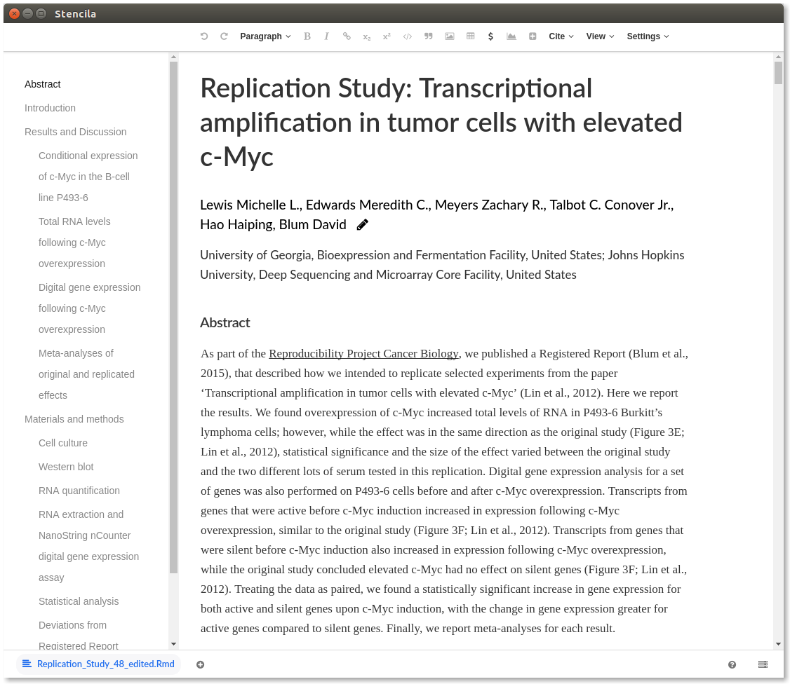

## Replicating a replication study

This example replicates the paper:

> Lewis, L. Michelle, et al. "Replication Study: Transcriptional amplification in tumor cells with elevated c-Myc." eLife 2018;7:e30274 DOI: 10.7554/eLife.30274

The full [article is available on the eLife website](https://elifesciences.org/articles/30274) and there is an Open Science Framework [folder containing code and data](https://osf.io/mokeb/).

The publication is available in [RMarkdown format](https://osf.io/vdrsh/download). Currently Stencila Desktop allows you to directly open only Dar (Reproducible Document Archive) format. So we used [`Stencila converter`](https://github.com/stencila/convert) to convert the file into `dar`. Then we had to do a few pre-processing steps:

1. Deleted the YAML header which included `knitr` and `pandoc` processing instructions e.g. `fontsize: 12pt`.
2. Extracted the preliminary code chunks which download files to [`setup.R`](https://github.com/stencila/examples/blob/master/elife-30274/Replication_Study_48.source/setup.R)
 and then ran it using `Rscript setup.R` which downloaded several files and did setup data manipulation.
3. Converted meta data from formatted text to structured YAML front matter.

You can compare the [original downloaded file](https://github.com/stencila/examples/blob/master/elife-30274/Replication_Study_48.source/Replication_Study_48.Rmd)
with the [file we edited](https://github.com/stencila/examples/blob/master/elife-30274/Replication_Study_48.source/Replication_Study_48_edited.Rmd).

There are still a few more steps to complete:
4. Complete translating meta data to YAML front matter.
5. Translate the references into Stencila interactive reference elements.
6. Put reproducible tables and figures inline (currently at end of document).
7. Implement [inline code cell outputs in Stencila](https://github.com/stencila/stencila/issues/618).

This example addresses the use case of a researcher who already uses RMarkdown and who wants to keep their work in that format as long as possible towards the final publication (i.e avoiding conversion to intermediate formats like `.docx` or `.pdf`)

