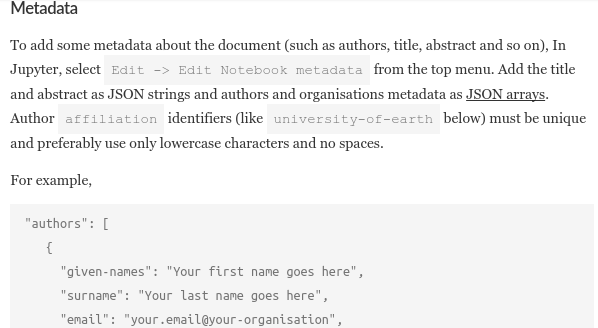

# Using Jupyter Notebook files in Stencila

This example shows how to get started using [Jupyter Notebook](http://jupyter.org/) in Stencila. Stencila will retain the
interactive code cells and keep the Markdown cells editable.

You can also edit Notebook metadata such as authors:

Stencila allows you to add references to your Notebook using *bibtex* format

The [`py-jupyter.source`](https://github.com/stencila/examples/tree/master/py-jupyter/py-jupyter.source) directory includes a Markdown file with the text of the analysis and some code samples. As it is Markdown, you cannot execute these bits of code. However,
you can open this file in Stencila which will allow you to interact with the code.

Currently Stencila Desktop allows you to directly open only Dar (Reproducible Document Archive) format. You can use [`Stencila converter`](https://github.com/stencila/convert)
in order to convert files from other popular formats (`md`, `Rmd`, `ipynb`, `tex`, `odt`, `html`, `docx`) into `dar`.

We already did this step for you, so if you don't want to deal with the conversion step, you can just download the [`examples`](https://github.com/stencila/examples/archive/master.zip) and open `py-jupyter.dar` folder in Stencila Desktop.
